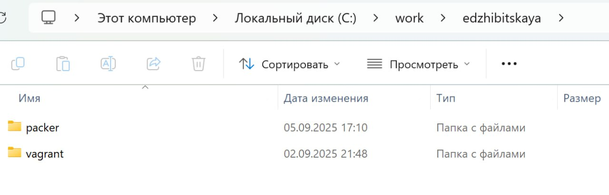
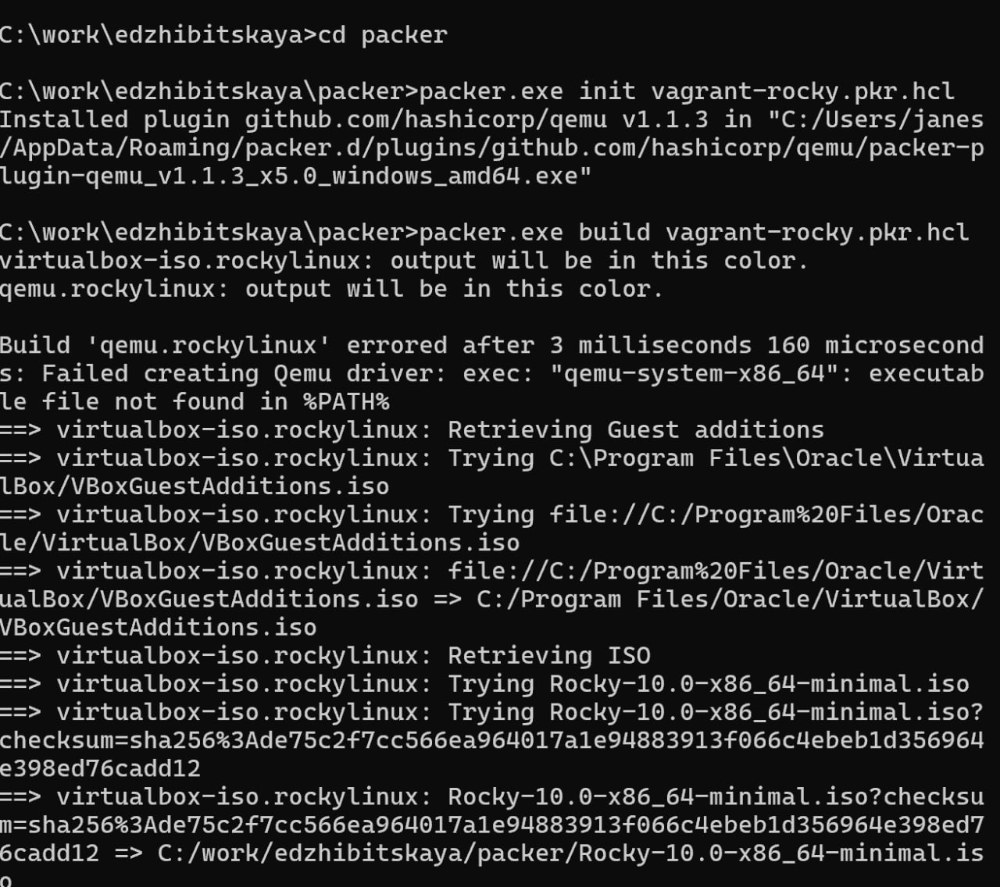
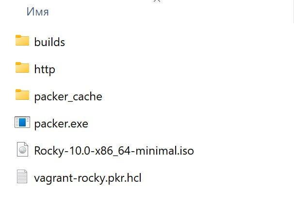
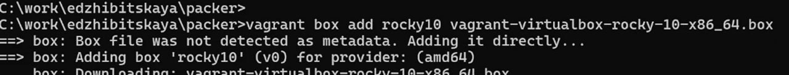
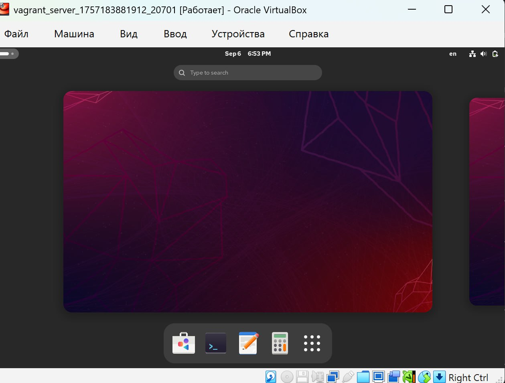
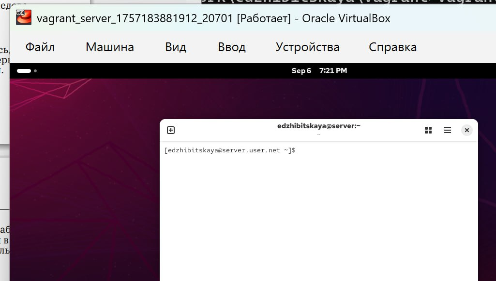
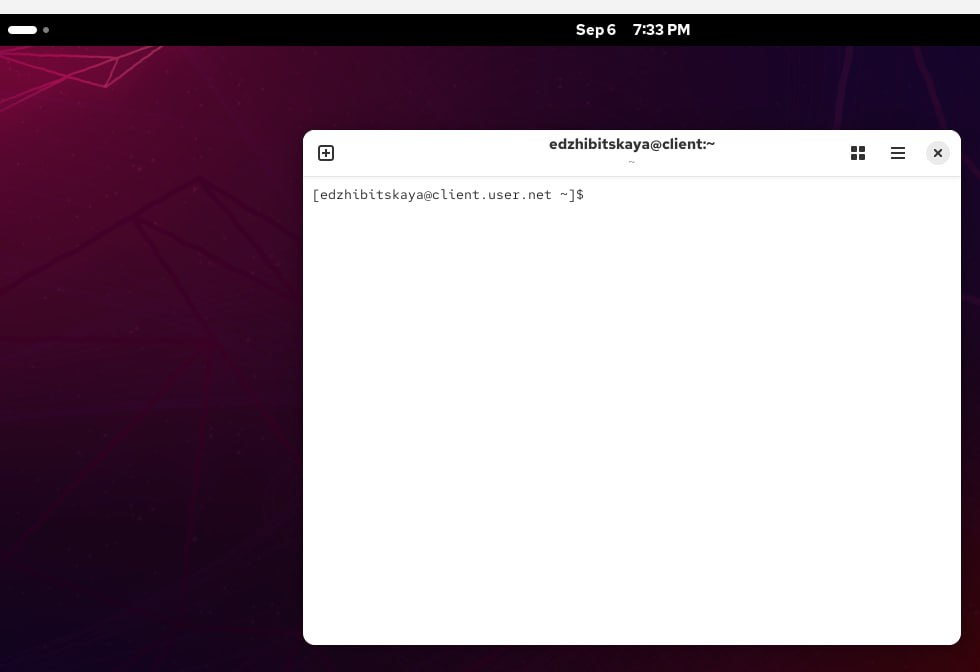

---
## Front matter
lang: ru-RU
title: Лабораторная №1
subtitle: Администрирование сетевых подсистем
author:
  - Жибицкая Е.Д.
institute:
  - Российский университет дружбы народов, Москва, Россия

## i18n babel
babel-lang: russian
babel-otherlangs: english

## Formatting pdf
toc: false
toc-title: Содержание
slide_level: 2
aspectratio: 169
section-titles: true
theme: metropolis
header-includes:
 - \metroset{progressbar=frametitle,sectionpage=progressbar,numbering=fraction}
---

# Цель

## Цель работы

- Приобретение навыков установки Rocky Linux на виртуальную машину с помощью Vagrant

# Ход работы 

## Подготовка

:::::::::::::: {.columns align=center}
::: {.column width="50%"}

Перед непосредственным развертыванием машины необходимо подготовить пространство, установить различные программы  и дополнения. Установим последнюю версию Vagrant, образ диска для Rocky, также нам понадобится Far и  Packer

:::
::: {.column width="40%"}

:::
::::::::::::::

## Создание структуры

:::::::::::::: {.columns align=center}
::: {.column width="50%"}

Далее приступим к созданию рабочей структуры. Создадим каталоги для работы и разместим нужные подкаталоги: work - edzhibitskaya - packer и vagrant
:::
::: {.column width="50%"}

:::
::::::::::::::

## Packer

:::::::::::::: {.columns align=center}
::: {.column width="50%"}

В каталог packer добавляем образ диска, файл vagrant-rocky.pkr.hcl и подкаталог http с файлом ks.cfg, который определяет настройки для установки дистрибутива, которые пользователь обычно вводит вручную.

:::
::: {.column width="50%"}

:::
::::::::::::::

## Vagrant

:::::::::::::: {.columns align=center}
::: {.column width="40%"}

:::
::: {.column width="60%"}

 В каталоге vagrant размещаем vagrantfile, создаем каталог provision
с подкаталогами default, server и client, в которых будут размещаться скрипты, изменяющие настройки внутреннего окружения базового (общего) образа виртуальной машины, сервера или клиента соответственно.
:::
::::::::::::::

## Скрипты

:::::::::::::: {.columns align=center}
::: {.column width="50%"}

:::
::::::::::::::

## Развертывание стенда на Windows

:::::::::::::: {.columns align=center}
::: {.column width="50%"}

Далее переходим к непосредственно развертыванию лабораторного стенда. Открываем терминал и с помощью far или же просто командной строки переходим в каталог, создаем машину. Команды:

- packer.exe init vagrant-rocky.pkr.hcl

- packer.exe build vagrant-rocky.pkr.hcl

:::
::::::::::::::

## Создание образа ОС

:::::::::::::: {.columns align=center}
::: {.column width="40%"}

:::
::: {.column width="60%"}

:::
::::::::::::::

## Регистрация и запуск

:::::::::::::: {.columns align=center}
::: {.column width="40%"}

:::
::: {.column width="60%"}
Команда vagrant box add rocky10 vagrant-virtualbox-rocky-10-x86_64.box

Далее запусаем ВМ Сервер и Клиент, проверяем, что есть возможность перейти к нашему созданному ранее пользователю и выключаем машину.
:::
::::::::::::::

## Регистрация и запуск

:::::::::::::: {.columns align=center}
::: {.column width="40%"}

:::
::: {.column width="40%"}

:::
::::::::::::::
## Проверка и завершение

:::::::::::::: {.columns align=center}
::: {.column width="40%"}

:::
::: {.column width="60%"}

Для корректной отработки скриптов убеждаемся, что необходимый код есть в Vagrantfile. Еще раз логинимся и смотрим, что скрипты отрабатываются. Предварительно фиксируем изменения командами vagrant up server/сlient --provision.
:::
::::::::::::::

## Проверка и завершение

:::::::::::::: {.columns align=center}
::: {.column width="40%"}

:::
::: {.column width="40%"}

:::
::::::::::::::

# Контрольные вопросы

1. Для чего предназначен Vagrant?

- Он предназначен для создания и управления средами виртуальных машин в одном процессе.

2. Что такое box-файл? В чём назначение Vagrantfile?

- box-файл (или Vagrant Box) — сохранённый образ виртуальной машины с развёрнутой в ней операционной системой; по сути, box-файл используется как основа для клонирования виртуальных машин с теми или иными настройками;

- Vagrantfile — конфигурационный файл, написанный на языке Ruby, в котором указаны настройки запуска виртуальной машины.

## Контрольные вопросы

3. Приведите описание и примеры вызова основных команд Vagrant.

– vagrant help — вызов справки по командам Vagrant;

– vagrant box add — подключение box-файла к Vagrant;

– vagrant destroy — отключение box-файла от Vagrant и удаление его из виртуального окружения;

– vagrant init — создание «шаблонного» конфигурационного файла
Vagrantfile для его последующего изменения;

– vagrant halt — остановка и выключение виртуальной машины;

– vagrant provision — настройка внутреннего окружения имеющейся виртуальной машины;

# Выводы

## Вывод

- В ходе работы были получены навыки по работе с Vagrant, установке с его помощью Rocky Linux на виртуальную машину

