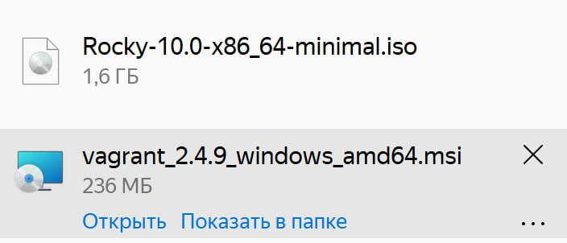
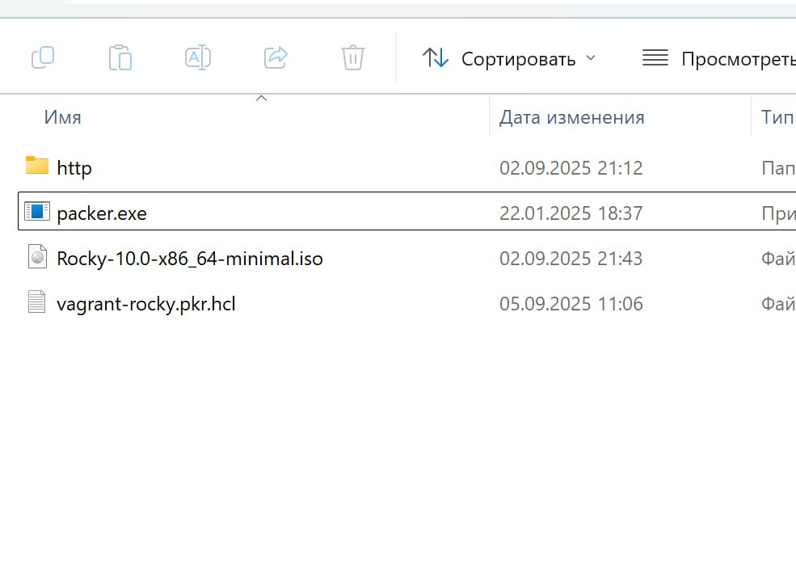
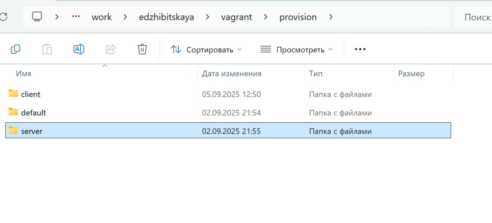
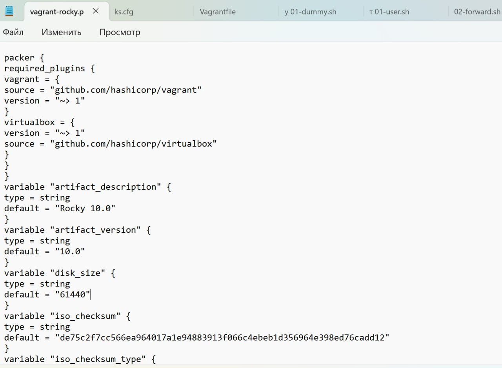
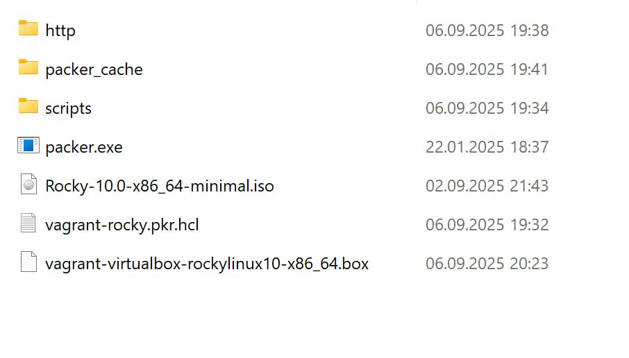
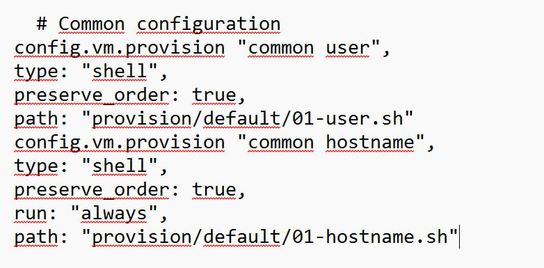

---
## Front matter
title: "Лабораторная работа №1"
subtitle: "Дисциплина: Администрирование сетевых подсистем"
author: "Жибицкая Евгения Дмитриевна"

## Generic otions
lang: ru-RU
toc-title: "Содержание"

## Bibliography
bibliography: bib/cite.bib
csl: pandoc/csl/gost-r-7-0-5-2008-numeric.csl

## Pdf output format
toc: true # Table of contents
toc-depth: 2
lof: true # List of figures
lot: true # List of tables
fontsize: 12pt
linestretch: 1.5
papersize: a4
documentclass: scrreprt
## I18n polyglossia
polyglossia-lang:
  name: russian
  options:
	- spelling=modern
	- babelshorthands=true
polyglossia-otherlangs:
  name: english
## I18n babel
babel-lang: russian
babel-otherlangs: english
## Fonts
mainfont: IBM Plex Serif
romanfont: IBM Plex Serif
sansfont: IBM Plex Sans
monofont: IBM Plex Mono
mathfont: STIX Two Math
mainfontoptions: Ligatures=Common,Ligatures=TeX,Scale=0.94
romanfontoptions: Ligatures=Common,Ligatures=TeX,Scale=0.94
sansfontoptions: Ligatures=Common,Ligatures=TeX,Scale=MatchLowercase,Scale=0.94
monofontoptions: Scale=MatchLowercase,Scale=0.94,FakeStretch=0.9
mathfontoptions:
## Biblatex
biblatex: true
biblio-style: "gost-numeric"
biblatexoptions:
  - parentracker=true
  - backend=biber
  - hyperref=auto
  - language=auto
  - autolang=other*
  - citestyle=gost-numeric
## Pandoc-crossref LaTeX customization
figureTitle: "Рис."
tableTitle: "Таблица"
listingTitle: "Листинг"
lofTitle: "Список иллюстраций"
lotTitle: "Список таблиц"
lolTitle: "Листинги"
## Misc options
indent: true
header-includes:
  - \usepackage{indentfirst}
  - \usepackage{float} # keep figures where there are in the text
  - \floatplacement{figure}{H} # keep figures where there are in the text
---

# Цель работы

Приобретение навыков установки Rocky Linux на виртуальную машину с помощью Vagrant.

# Выполнение лабораторной работы

Перед непосредственным развертыванием машины необходимо подготовить пространство, установить различные программы  и дополнения. Установим последнюю версию Vagrant, образ диска для Rocky, также нам понадобится Far и  Packer(рис. [-@fig:001]).

{#fig:001 width=70%}

Далее приступим к созданию рабочей структуры. Создадим каталоги для работы и разместим нужные подкаталоги: work - edzhibitskaya - packer и vagrant(рис. [-@fig:002]).

{#fig:002 width=70%}

В каталог packer добавляем образ диска, файл vagrant-rocky.pkr.hcl и подкаталог http с файлом ks.cfg, который определяет настройки для установки дистрибутива, которые пользователь обычно вводит вручную. Такжде добавляем туда packer.exe (рис. [-@fig:003]).

{#fig:003 width=70%}

 В каталоге vagrant размещаем vagrantfile, создаем каталог provision
с подкаталогами default, server и client, в которых будут размещаться скрипты, изменяющие настройки внутреннего окружения базового (общего) образа виртуальной машины, сервера или клиента соответственно. Размещаем там заранее подготовленный скриптзаглушку 01-dummy.sh(рис. [-@fig:004]).

{#fig:004 width=70%}

В созданных файлах размещаем данные нам скрипты, меняем в файле vagrant-rocky.pkr.hcl значение чек-суммы, версию Rocky(рис. [-@fig:005]).

{#fig:005 width=70%}

Далее переходим к непосредственно развертыванию лабораторного стенда. Открываем терминал и с помощью far или же просто командной строки переходим в каталог, создаем машину используя команды 

packer.exe init vagrant-rocky.pkr.hcl
packer.exe build vagrant-rocky.pkr.hcl

Запускается установка образа операционной системы(рис. [-@fig:006]) и (рис. [-@fig:007]).

{#fig:006 width=70%}

{#fig:007 width=70%}

Для регистрации в Vagrant вводим команду vagrant box add rocky10 vagrant-virtualbox-rocky-10-x86_64.box(рис. [-@fig:008]).

{#fig:008 width=70%}

Далее запускаем ВМ Сервер и Клиент, проверяем, что есть возможность перейти к нашему созданному ранее пользователю и выключаем машину.Для корректной отработки скриптов убеждаемся, что необходимый код есть в Vagrantfile(рис. [-@fig:009]). Еще раз логинимся и смотрим, что скрипты отрабатываются. Предварительно фиксируем изменения командами vagrant up server/сclient --provision

{#fig:009 width=70%}

# Контрольные вопросы
1. Для чего предназначен Vagrant?

Он предназначен для создания и управления средами виртуальных машин в одном процессе.

2. Что такое box-файл? В чём назначение Vagrantfile?

- box-файл (или Vagrant Box) — сохранённый образ виртуальной машины с развёрнутой в ней операционной системой; по сути, box-файл используется как основа для
клонирования виртуальных машин с теми или иными настройками;
- Vagrantfile — конфигурационный файл, написанный на языке Ruby, в котором указаны настройки запуска виртуальной машины.

3. Приведите описание и примеры вызова основных команд Vagrant.

– vagrant help — вызов справки по командам Vagrant;

– vagrant box list — список подключённых к Vagrant box-файлов;

– vagrant box add — подключение box-файла к Vagrant;

– vagrant destroy — отключение box-файла от Vagrant и удаление его из виртуального окружения;

– vagrant init — создание «шаблонного» конфигурационного файла
Vagrantfile для его последующего изменения;

– vagrant up — запуск виртуальной машины с использованием инструкций по запуску из конфигурационного файла Vagrantfile;
 
– vagrant reload — перезагрузка виртуальной машины;

– vagrant halt — остановка и выключение виртуальной машины;

– vagrant provision — настройка внутреннего окружения имеющейся виртуальной машины (например, добавление новых инструкций (скриптов) ранее созданную виртуальную машину);

– vagrant ssh — подключение к виртуальной машине через ssh.

# Выводы

В ходе работы были получены навыки по работе с Vagrant и установке с его помощью Rocky Linux на виртуальную машину.

# Список литературы{.unnumbered}

[ТУИС](https://esystem.rudn.ru/course/view.php?id=9060)
