---
## Front matter
lang: ru-RU
title: Лабораторная №2
subtitle: Администрирование сетевых подсистем
author:
  - Жибицкая Е.Д.
institute:
  - Российский университет дружбы народов, Москва, Россия

## i18n babel
babel-lang: russian
babel-otherlangs: english

## Formatting pdf
toc: false
toc-title: Содержание
slide_level: 2
aspectratio: 169
section-titles: true
theme: metropolis
header-includes:
 - \metroset{progressbar=frametitle,sectionpage=progressbar,numbering=fraction}
---

# Цель

## Цель работы

- Приобретение навыков по установке и конфигурированию DNS-сервера
- Усвоение принципов работы системы доменных имён на ОС Rocky Linux

# Ход работы

## Подготовка

:::::::::::::: {.columns align=center}
::: {.column width="50%"}

Для начала загружаем операционную систему, переходим в каталог Vagrant

:::
::: {.column width="50%"}

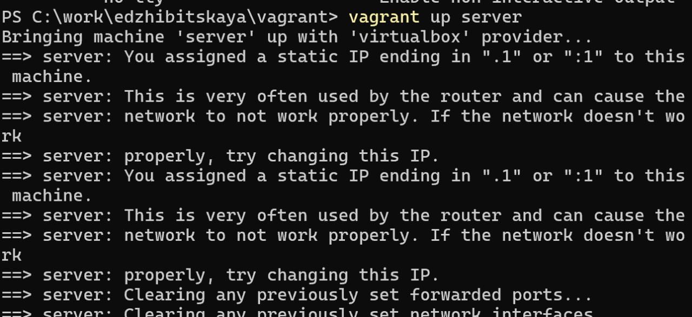

:::
::::::::::::::

## Начало работы

:::::::::::::: {.columns align=center}
::: {.column width="50%"}

:::
::: {.column width="40%"}

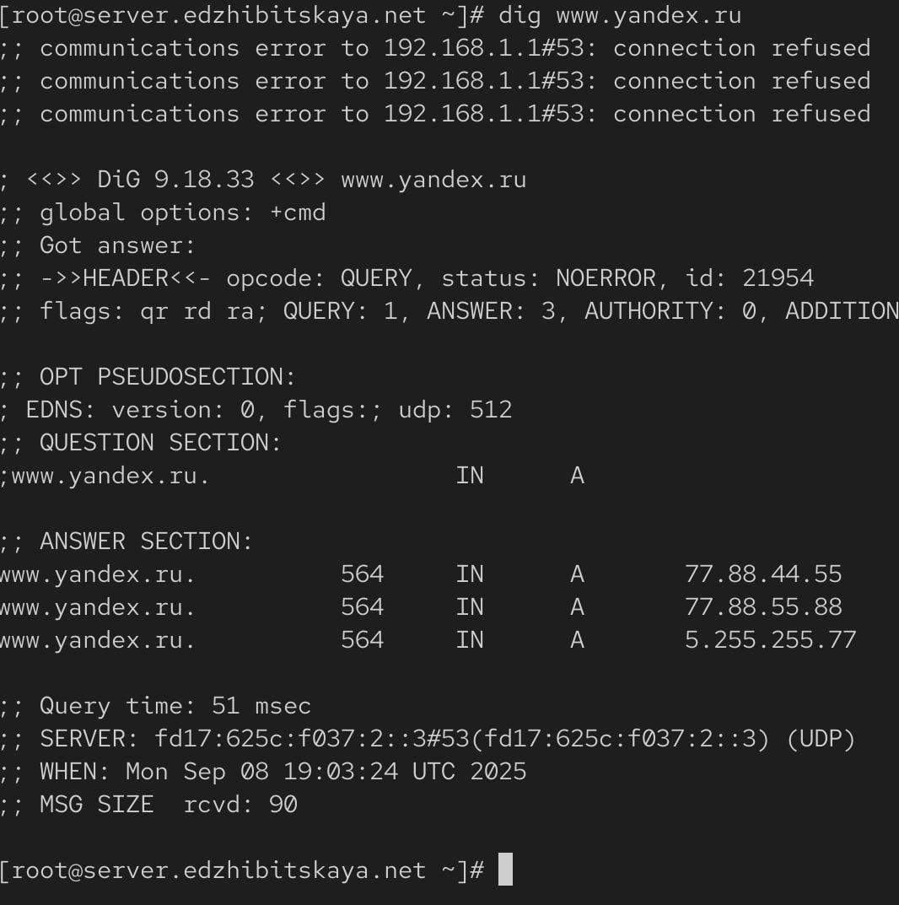

:::
::::::::::::::

## Просмотр содержимого файлов

:::::::::::::: {.columns align=center}
::: {.column width="50%"}

В файле /etc/resolv.conf указано к каким DNS-серверам обращаться для преобразования доменных имен в IP-адреса и наоборот

:::
::: {.column width="50%"}

:::
::::::::::::::

## Просмотр содержимого файлов

:::::::::::::: {.columns align=center}
::: {.column width="50%"}

:::
::: {.column width="50%"}

/etc/named.conf - главный конфигурационный файл демона BIND (named). Он определяет общие параметры работы DNS-сервера, зоны, которые он обслуживает, и политики доступа

:::
::::::::::::::

## Просмотр содержимого файлов

:::::::::::::: {.columns align=center}
::: {.column width="50%"}

/var/named/named.localhost - это файл прямой зоны для домена localhost. Он сопоставляет имя localhost с IP-адресом 127.0.0.1

/var/named/named.loopback - это файл обратной зоны, выполняет обратное преобразование

:::
::: {.column width="50%"}

:::
::::::::::::::

## Запуск DNS-сервера

## Анализ dig

:::::::::::::: {.columns align=center}
::: {.column width="50%"}

Проанализируем вывод команд dig www.yandex.ru и dig @127.0.0.1 www.yandex.ru. Вторая команда дает больший вывод, так как в ней мы еще указываем к какому серверу обращаться, она помогает в отладке и диагностике конфигурации

:::
::: {.column width="40%"}

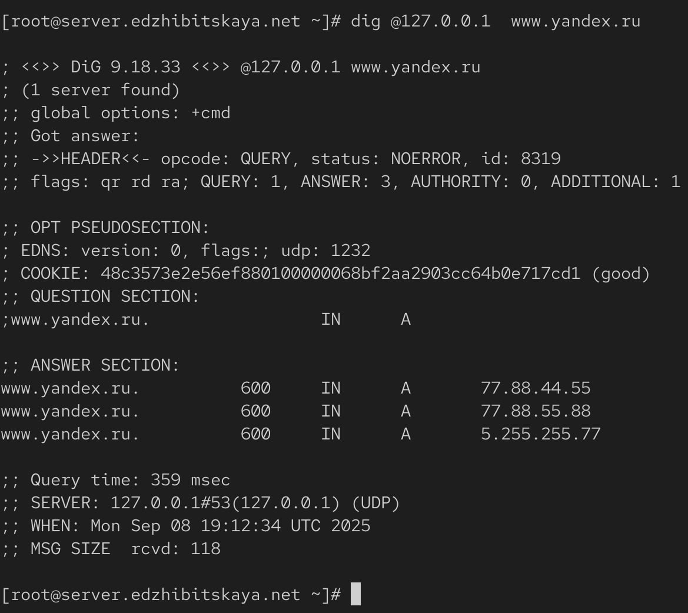

:::
::::::::::::::

## Настройка соединения

:::::::::::::: {.columns align=center}
::: {.column width="50%"}

Далее сделаем DNS-сервер сервером по умолчанию для хоста server и внутренней виртуальной сети

:::
::: {.column width="40%"}

:::
::::::::::::::

## Направления запросов

:::::::::::::: {.columns align=center}
::: {.column width="40%"}

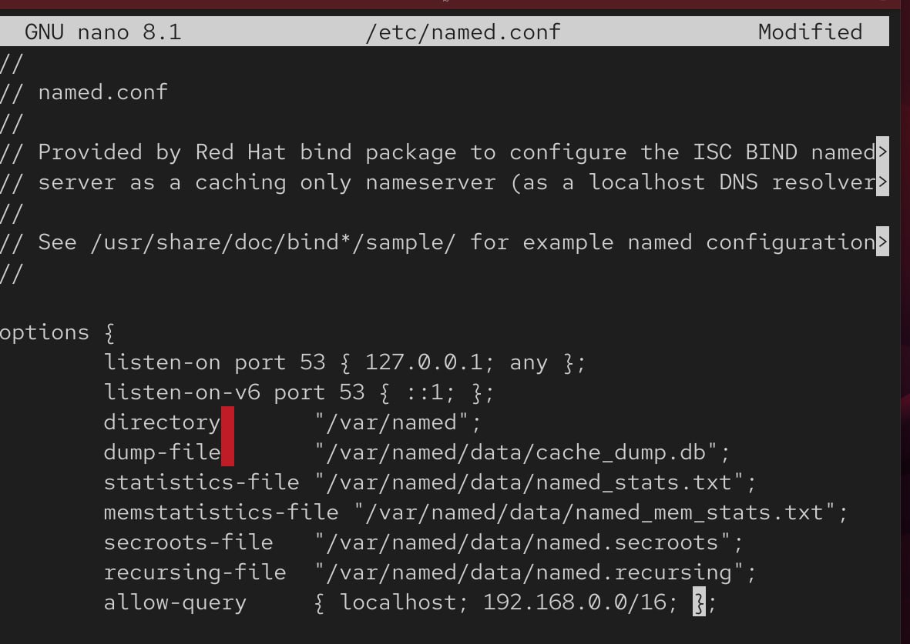

:::
::: {.column width="60%"}

Также настраиваем направление DNS-запросов от всех узлов внутренней сети, включая запросы от узла server, через узел server. Для этого редактируем файл /etc/named.conf

:::
::::::::::::::

## Работа с firewall

:::::::::::::: {.columns align=center}
::: {.column width="40%"}

Вносим изменения в настройки межсетевого экрана узла server, убеждаемся, что DNS-запросы идут через узел server

:::
::: {.column width="50%"}

:::
::::::::::::::

## named.conf

:::::::::::::: {.columns align=center}
::: {.column width="40%"}

В ситуации, когда DNS-запросы от сервера фильтруются сетевым оборудованием, следует добавить перенаправление DNS-запросов на конкретный вышестоящий DNS-сервер

:::
::: {.column width="50%"}

:::
::::::::::::::

## Работа с файлами

:::::::::::::: {.columns align=center}
::: {.column width="40%"}

Далее копируем шаблон описания DNS-зон named.rfc1912.zones из каталога /etc в каталог /etc/named и переименовываем его

:::
::: {.column width="60%"}

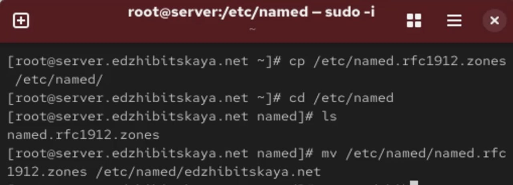

:::
::::::::::::::

## Редактирование файлов

:::::::::::::: {.columns align=center}
::: {.column width="40%"}

:::
::: {.column width="50%"}

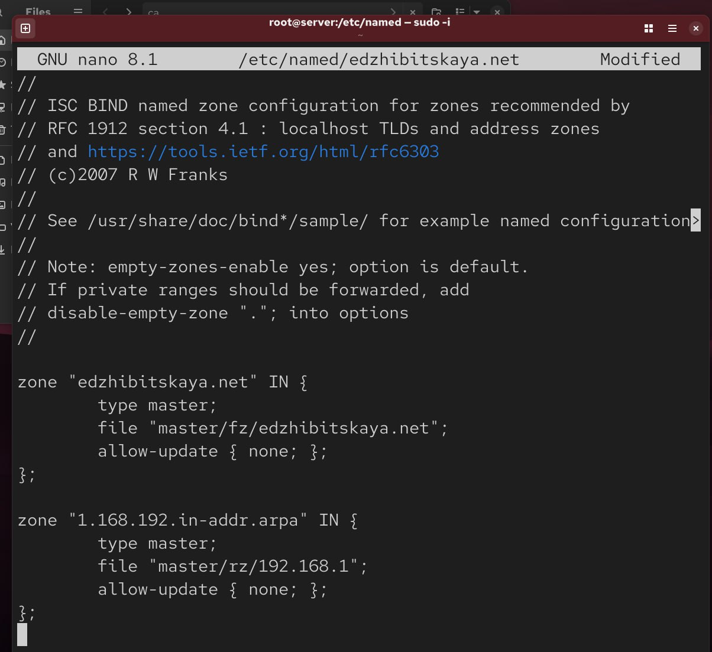

:::
::::::::::::::

## Fz и rz

:::::::::::::: {.columns align=center}
::: {.column width="40%"}

:::
::: {.column width="60%"}

В каталоге /var/named создаем подкаталоги master/fz и master/rz, в которых будут располагаться файлы прямой и обратной зоны соответственно, скопируем шаблон прямой DNS-зоны named.localhost и переименуем его

:::
::::::::::::::

## Редактирование edzhibitskaya.net
:::::::::::::: {.columns align=center}
::: {.column width="70%"}

:::
::::::::::::::

## Работа с файлом обратной DNS-зоны

:::::::::::::: {.columns align=center}
::: {.column width="40%"}

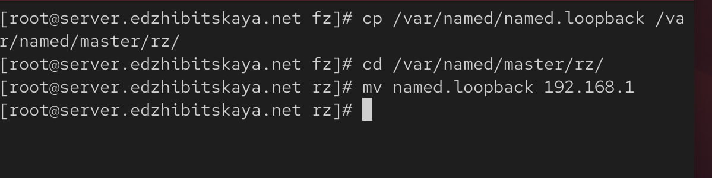

:::
::: {.column width="60%"}

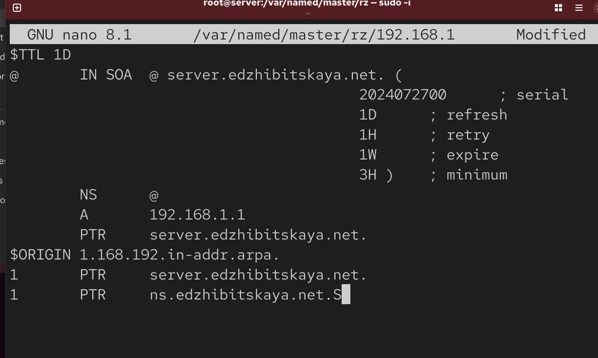

:::
::::::::::::::

## Наделение прав и метки SELinux

:::::::::::::: {.columns align=center}
::: {.column width="40%"}

Исправляем права доступа к файлам в каталогах /etc/named и /var/named, чтобы демон named мог с ними работать и после изменения доступа к конфигурационным файлам named корректно восстанавливаем их метки в SELinux

:::
::: {.column width="60%"}

:::
::::::::::::::

## Переключатели и перезапуск DNS-сервера

:::::::::::::: {.columns align=center}
::: {.column width="40%"}

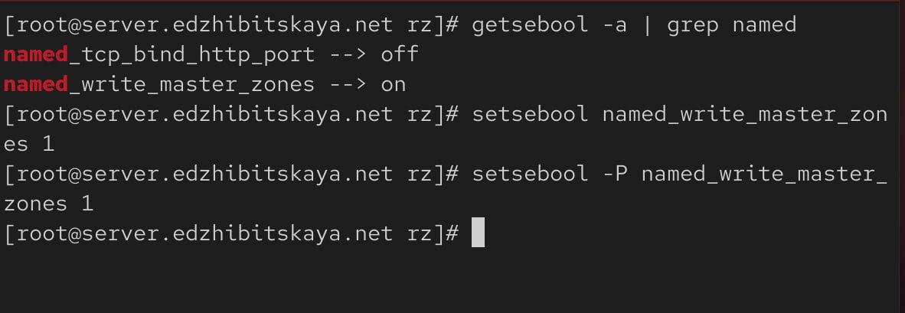

:::
::: {.column width="60%"}

:::
::::::::::::::

## Анализ работы DNS-сервера

:::::::::::::: {.columns align=center}
::: {.column width="40%"}

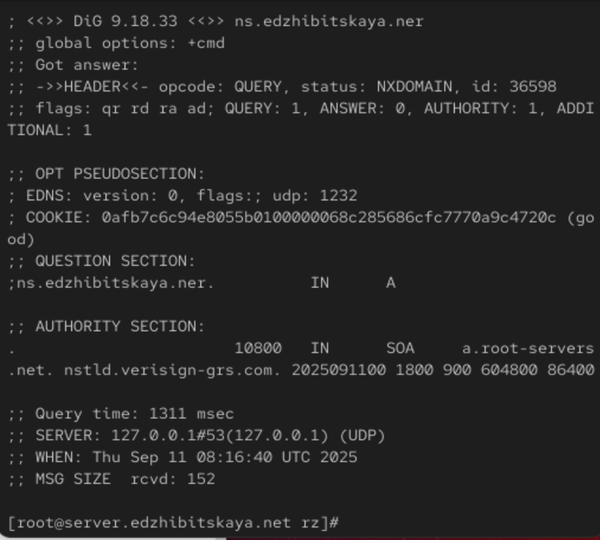

:::
::: {.column width="60%"}

Для анализа работы DNS-сервера воспользуемся утилитами dig и host

:::
::::::::::::::

## Анализ работы DNS-сервера

:::::::::::::: {.columns align=center}
::: {.column width="40%"}

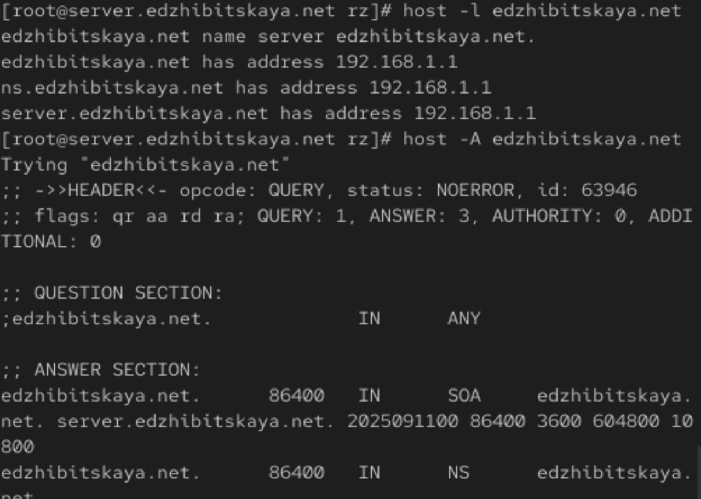

:::
::: {.column width="60%"}

:::
::::::::::::::

## Сохранение изменений

:::::::::::::: {.columns align=center}
::: {.column width="40%"}

Наконец, в каталог для внесения изменений в настройки внутреннего окружения добавим необходимые директории, создадим исполняемый файл и пропишем скрипт.

:::
::: {.column width="60%"}

:::
::::::::::::::

## Сохранение изменений

:::::::::::::: {.columns align=center}
::: {.column width="40%"}

:::
::: {.column width="40%"}

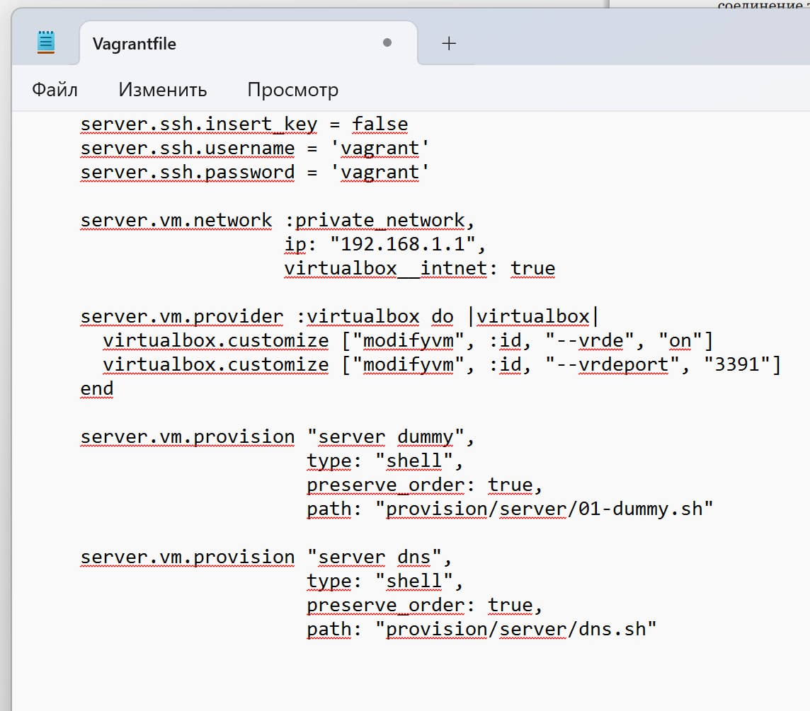

:::
::::::::::::::

# Выводы

## Вывод

- В ходе работы были получены навыки по установке и конфигурированию DNS-сервера и усвоены принципы работы системы доменных имён на ОС Rocky Linux
