---
## Front matter
title: "Лабораторная работа №2"
subtitle: "Дисциплина: Администрирование сетевых подсистем"
author: "Жибицкая Евгения Дмитриевна"

## Generic otions
lang: ru-RU
toc-title: "Содержание"

## Bibliography
bibliography: bib/cite.bib
csl: pandoc/csl/gost-r-7-0-5-2008-numeric.csl

## Pdf output format
toc: true # Table of contents
toc-depth: 2
lof: true # List of figures
lot: true # List of tables
fontsize: 12pt
linestretch: 1.5
papersize: a4
documentclass: scrreprt
## I18n polyglossia
polyglossia-lang:
  name: russian
  options:
  - spelling=modern
  - babelshorthands=true
polyglossia-otherlangs:
  name: english
## I18n babel
babel-lang: russian
babel-otherlangs: english
## Fonts
mainfont: IBM Plex Serif
romanfont: IBM Plex Serif
sansfont: IBM Plex Sans
monofont: IBM Plex Mono
mathfont: STIX Two Math
mainfontoptions: Ligatures=Common,Ligatures=TeX,Scale=0.94
romanfontoptions: Ligatures=Common,Ligatures=TeX,Scale=0.94
sansfontoptions: Ligatures=Common,Ligatures=TeX,Scale=MatchLowercase,Scale=0.94
monofontoptions: Scale=MatchLowercase,Scale=0.94,FakeStretch=0.9
mathfontoptions:
## Biblatex
biblatex: true
biblio-style: "gost-numeric"
biblatexoptions:
  - parentracker=true
  - backend=biber
  - hyperref=auto
  - language=auto
  - autolang=other*
  - citestyle=gost-numeric
## Pandoc-crossref LaTeX customization
figureTitle: "Рис."
tableTitle: "Таблица"
listingTitle: "Листинг"
lofTitle: "Список иллюстраций"
lotTitle: "Список таблиц"
lolTitle: "Листинги"
## Misc options
indent: true
header-includes:
  - \usepackage{indentfirst}
  - \usepackage{float} # keep figures where there are in the text
  - \floatplacement{figure}{H} # keep figures where there are in the text
---

# Цель работы

Приобретение навыков по установке и конфигурированию DNS-сервера, усвоение принципов работы системы доменных имён на ОС Rocky linux.

# Выполнение лабораторной работы

Для начала загружаем операционную систему, перейдся в каталог Vagrant(рис. [-@fig:001]).

{#fig:001 width=70%}

Открываем терминал, переходим в режим суперпользователя и устанавливаем bind, bind-utils(рис. [-@fig:002]).

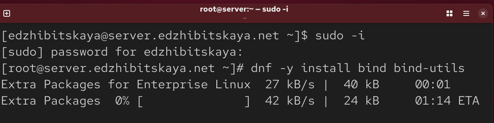{#fig:002 width=70%}

Затем в качетсве тренировки делаем запрос к DNS-адресу Яндекса(рис. [-@fig:003]).

{#fig:003 width=70%}

Затем просмотрим содержимое  файлов /etc/resolv.conf,
/etc/named.conf, /var/named/named.ca, /var/named/named.localhost,
/var/named/named.loopback.

В файле /etc/resolv.conf указано к каким DNS-серверам обращаться для преобразования доменных имен в IP-адреса и наоборот(рис. [-@fig:004]).

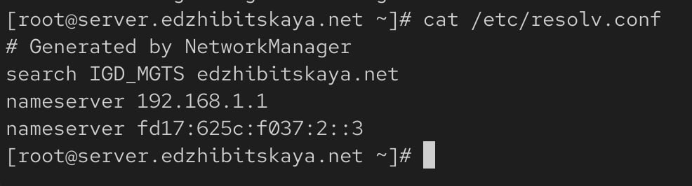{#fig:004 width=70%}

/etc/named.conf главный конфигурационный файл демона BIND (named). Он определяет общие параметры работы DNS-сервера, зоны, которые он обслуживает, и политики доступа(рис. [-@fig:005]).

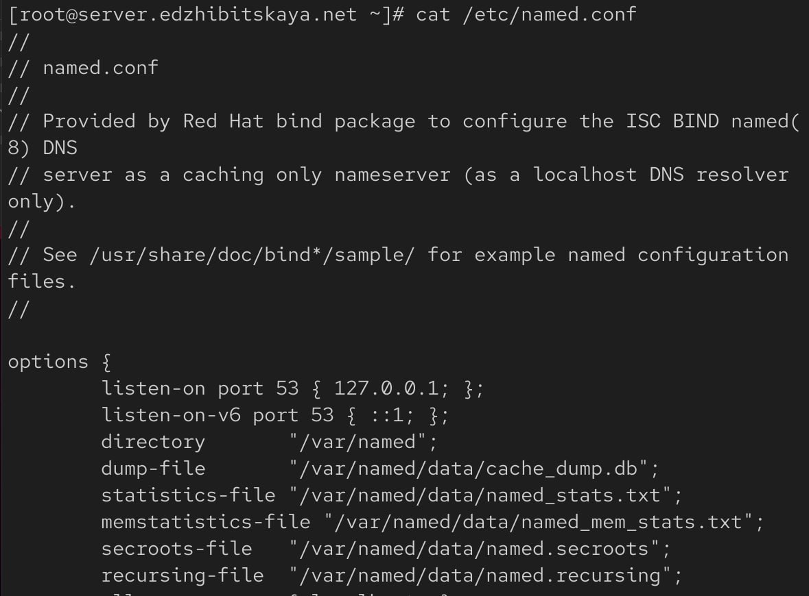{#fig:005 width=70%}

/var/named/named.ca содержит список IP-адресов корневых DNS-серверов (root hints). Когда  DNS-сервер не знает, куда направить запрос для какого-либо домена, он начинает поиск с этих корневых серверов

/var/named/named.localhost -  это файл прямой зоны для домена localhost. Он сопоставляет имя localhost с IP-адресом 127.0.0.1

/var/named/named.loopback - это файл обратной зоны (reverse zone) для сетей IPv4 и IPv6. Он выполняет обратное преобразование: по IP-адресу 127.0.0.1 находит имя localhost(рис. [-@fig:006]).

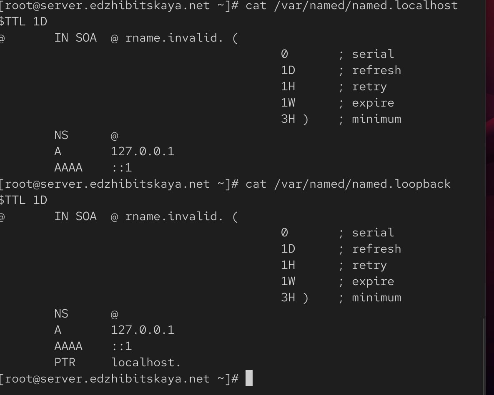{#fig:006 width=70%}

Затем запустим DNS-сервер, включим его автозапуск(рис. [-@fig:007]).

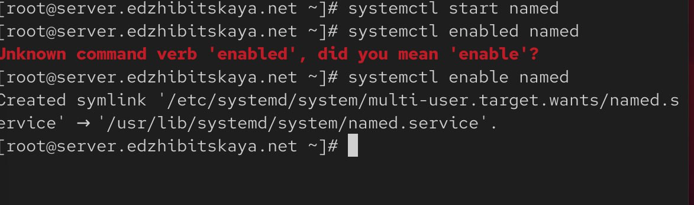{#fig:007 width=70%}

Проанализируем вывод команд dig www.yandex.ru и dig @127.0.0.1 www.yandex.ru(рис. [-@fig:008]). Вторая команда дает больший вывод, так как в ней мы еще указываем к какому серверу обращаться, она помогает в отладкеи диагностике конфигурации

{#fig:008 width=70%}

Далее сделаем DNS-сервер сервером по умолчанию для хоста server и внутренней виртуальной сети, изменим настройки сетевого соединения eth0
в NetworkManager, переключив его на работу с внутренней сетью и указав для него в качестве DNS-сервера по умолчанию адрес 127.0.0. Перезапускаем менеджер, проверяем наличие изменений (рис. [-@fig:009]).

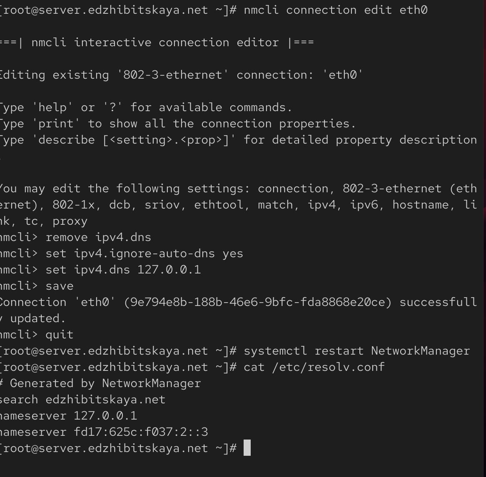{#fig:009 width=70%}

Также настраиваем направление DNS-запросов от всех узлов внутренней сети,
включая запросы от узла server, через узел server. Для этого редактируем  файл /etc/named.conf(рис. [-@fig:010]).

{#fig:010 width=70%}

Вносим изменения в настройки межсетевого экрана узла server, убеждаемся, что DNS-запросы идут через узел server(рис. [-@fig:011]).

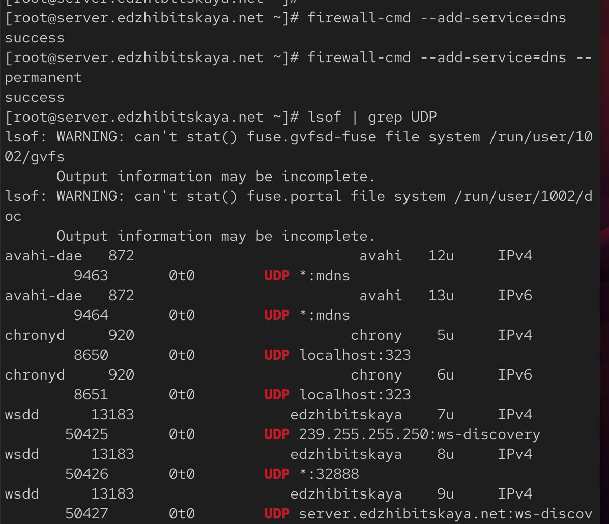{#fig:011 width=70%}

В ситуации, когда DNS-запросы от сервера фильтруются сетевым оборудованием, следует добавить перенаправление DNS-запросов
на конкретный вышестоящий DNS-сервер. Для этого в конфигурационный файл
named.conf в секцию options добавим данные, предварительно посмотрев их на локальном хосте (рис. [-@fig:012]).

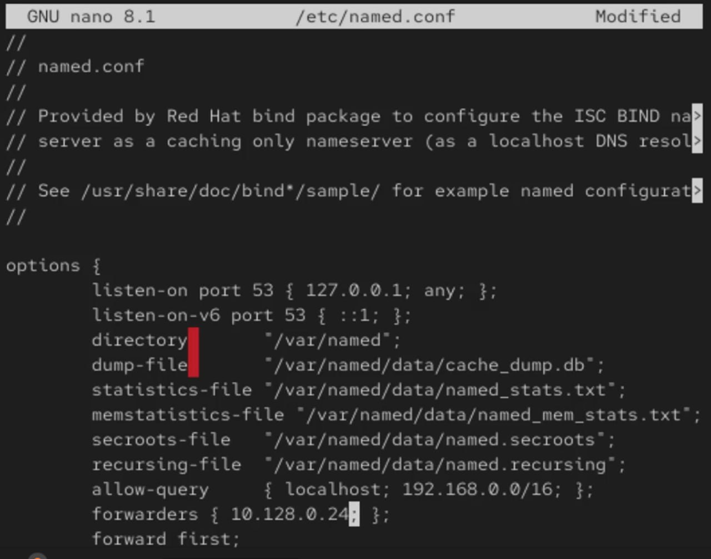{#fig:012 width=70%}

Далее копируем шаблон описания DNS-зон named.rfc1912.zones из каталога /etc в каталог /etc/named и переименовываем его(рис. [-@fig:013]).

{#fig:013 width=70%}

Включим файл описания зоны /etc/named/user.net в конфигурационном файле
DNS /etc/named.conf(рис. [-@fig:014]), отредактируем  файл /etc/named/edzhibitskaya.net(рис. [-@fig:015]).

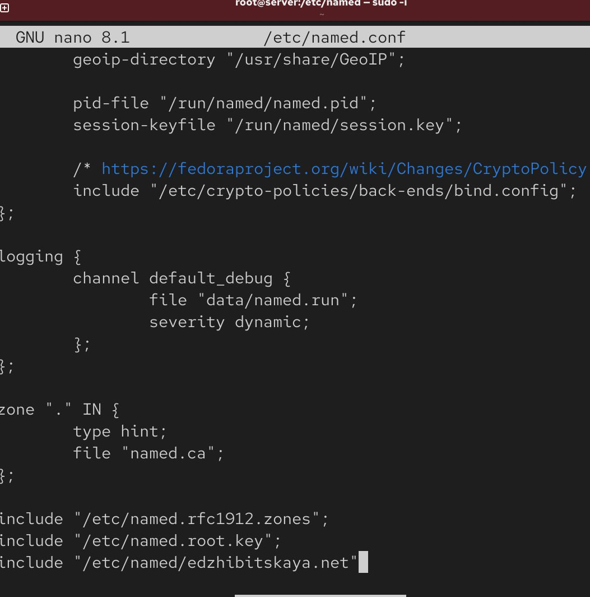{#fig:014 width=70%}

{#fig:015 width=70%}

В каталоге /var/named создаем подкаталоги master/fz и master/rz, в которых будут располагаться файлы прямой и обратной зоны соответственно, скопируем шаблон прямой DNS-зоны named.localhost и переименуем его в edzhibitskaya.net(рис. [-@fig:016]).

{#fig:016 width=70%}

Далее редактируем файл(рис. [-@fig:017]).

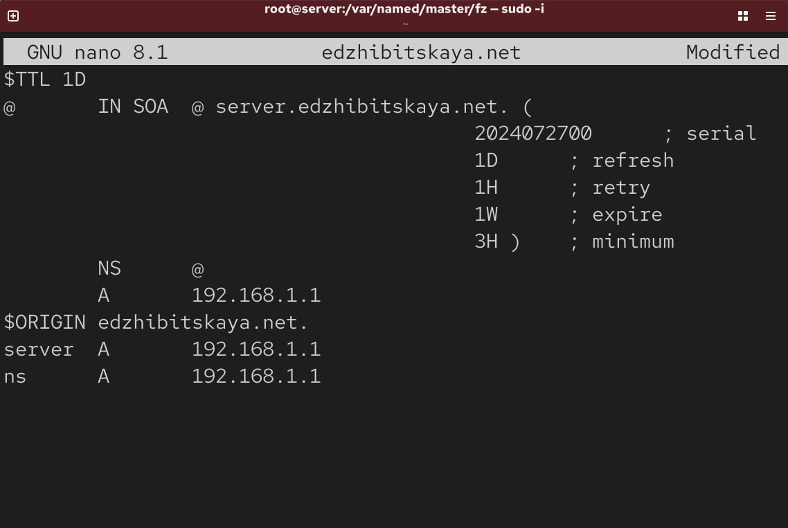{#fig:017 width=70%}

Копируем шаблон обратной DNS-зоны named.loopback, переименовываем его в 192.168.1(рис. [-@fig:018]), также редактируем(рис. [-@fig:019]).

{#fig:018 width=70%}

{#fig:019 width=70%}

Исправляем права доступа к файлам в каталогах /etc/named
и /var/named, чтобы демон named мог с ними работать и после изменения
доступа к конфигурационным файлам named корректно восстановливаем их
метки в SELinux(рис. [-@fig:020]).

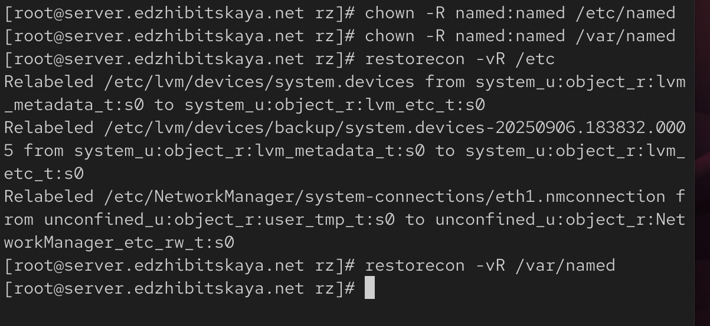{#fig:020 width=70%}

Еще необходимо проверить состояние переключателей, дать разрешение на запись(рис. [-@fig:021]).

{#fig:021 width=70%}

В дополнительном терминале запускаем в режиме реального времени расширенный лог системных сообщений и в первом терминале перезапускаем сервер(рис. [-@fig:022]).

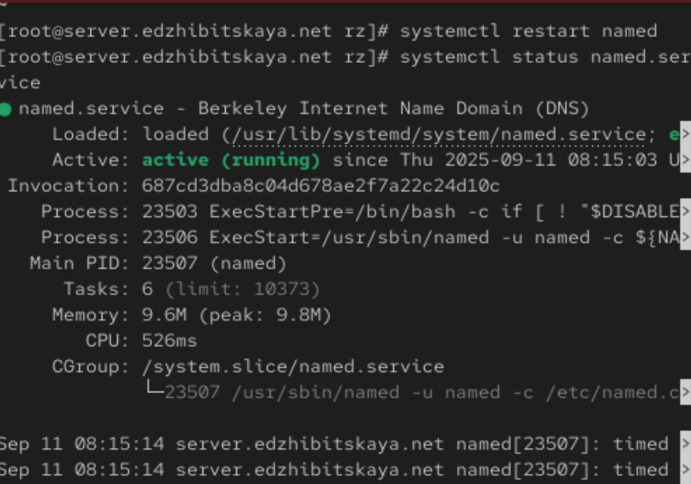{#fig:022 width=70%}

Для анализа работы DNS-сервера воспользуемся утилитами dig и  host(рис. [-@fig:023]) и (рис. [-@fig:024]), (рис. [-@fig:025]).

{#fig:023 width=70%}

{#fig:024 width=70%}

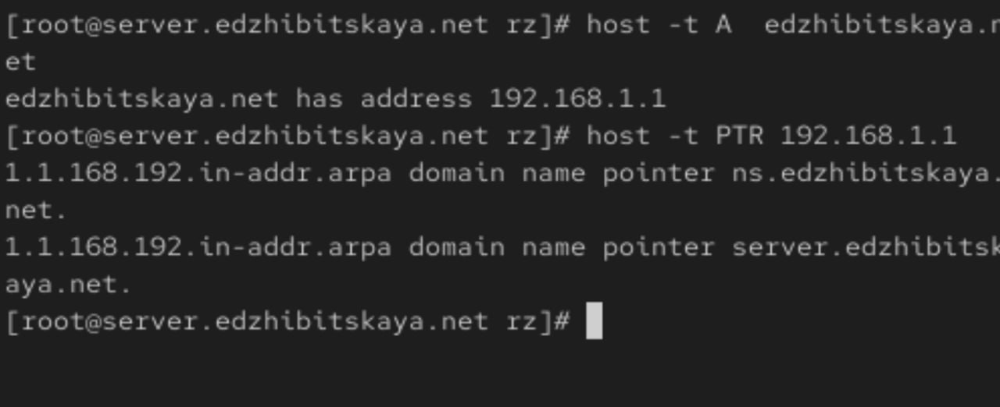{#fig:025 width=70%}

Наконец, в каталог для внесения изменений в настройки внутреннего окружения добавим необходимые директории(рис. [-@fig:026]), создадим исполняемый файл(рис. [-@fig:027]) и пропишем скрипт(рис. [-@fig:028]).

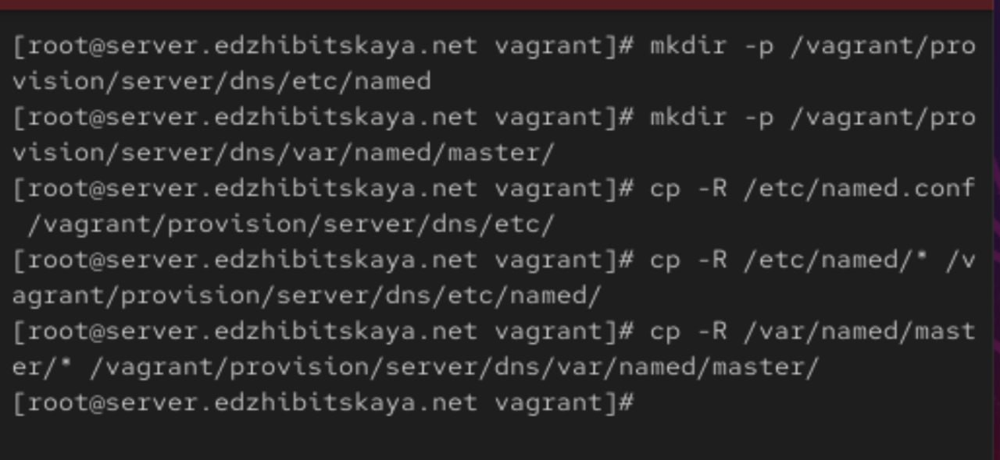{#fig:026 width=70%}

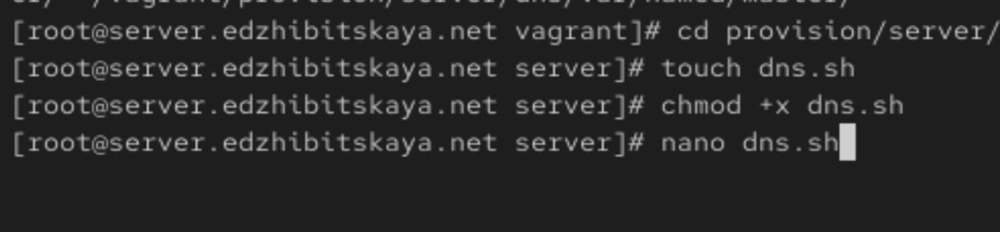{#fig:027 width=70%}

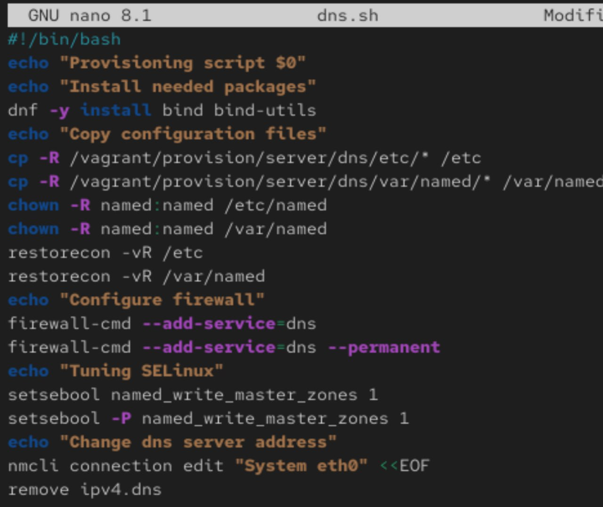{#fig:028 width=70%}

Внесем изменения в Vagrantfile для отработки  скрипта(рис. [-@fig:029]).

{#fig:029 width=70%}

# Ответы на контрольные вопросы

1. Что такое DNS?

Система доменных имён, преобразующая имена в IP-адреса и обратно.

2. Каково назначение кэширующего DNS-сервера?

Кэшировать DNS-запросы для ускорения ответов и снижения сетевой нагрузки.

3. Чем отличается прямая DNS-зона от обратной?

- Прямая: имя → IP

- Обратная: IP → имя

4. В каких каталогах и файлах настройки DNS-сервера?
 
- `/etc/named.conf` – главный конфиг

- `/var/named/` – файлы зон (зона.db)

5. Что указывается в файле resolv.conf?

Адреса DNS-серверов для клиента: `nameserver 8.8.8.8`

6. Какие есть типы записей ресурсов?

- A – IPv4 адрес

- AAAA – IPv6 адрес

- CNAME – псевдоним

- MX – почтовый сервер

- NS – DNS-сервер зоны

- PTR – обратная запись (IP → имя)

7. Для чего используется домен in-addr.arpa? 

Для организации обратных зон DNS (поиск имени по IP).

8. Для чего нужен демон named?

Это основная служба DNS-сервера BIND, обрабатывающая запросы.

9. Функции master/slave серверов?

- Master – авторитативный, хранит оригиналы зон

- Slave – резервный, копирует зоны с master

10. Параметры времени обновления зоны? 

- refresh – время обновления

- retry – время повтора при ошибке

- expire – время устаревания

- TTL – время жизни кэша

11. Как защитить зону от скачивания?

Настроить ACL и запретить трансфер зоны для посторонних.

12. Запись для почтовых серверов?

MX (Mail Exchange).

13. Как протестировать DNS?

Команды: `nslookup`, `dig`, `host`.

14. Управление службами?

- systemctl start <служба>

- systemctl stop <служба>

- systemctl restart <служба>

15. Просмотр отладочной информации?

journalctl -u <служба>

16. Где хранятся логи?

/var/log/. Просмотр: journalctl, tail -f /var/log/messages

17. Какие файлы использует процесс?

lsof -p <PID>

18. Примеры nmcli:

- nmcli con up eth0

- nmcli con modify eth0 ipv4.addresses "192.168.1.10/24"

19. Что такое SELinux?

Система принудительного контроля доступа, дополняющая стандартные права.

20. Что такое контекст SELinux?

Метка безопасности, определяющая политику доступа для объекта.

21. Как восстановить контекст?

restorecon -Rv /путь/

22. Как создать правила из логов?

audit2allow -a -M модуль

23. Булевый переключатель?

Параметр, который можно включить или выключить для изменения поведения политики.

24. Список переключателей?

getsebool -a

25. Изменение переключателя?

setsebool -P httpd_can_network_connect on

# Выводы

В ходе работы были получены навыки по  установке и конфигурированию DNSсервера, усвоены принципы  работы системы доменных имён на ОС Rocky linux.

# Список литературы{.unnumbered}

[ТУИС]{https://esystem.rudn.ru/pluginfile.php/2854732/mod_resource/content/8/002-dns.pdf}
